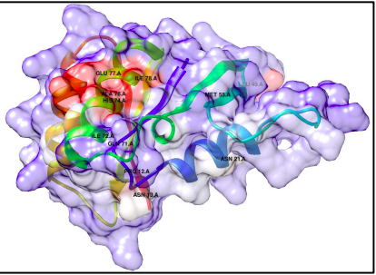

# CPDA - Conserved Protein Domain Analysis

*This project is still under development...*

Proteins participate in numerous cellular processes and are essential for cell growth and survival. Proteins interact with a variety of other molecules to achieve these tasks.
Studying these interactions has provided researchers with critical information in regards to the functionality and mechanism of action of the protein. 

Studying the sites where these crucial interactions take place can be immensely helpful in the development of drugs against target proteins from pathogenic bacterial species. 

While there are multiple algorithms currently available to predict ligand-binding sites, none of these account for the high amino acid conservation at these sites. The majority of harmful side effects are caused as a result of, the administration of drugs that target these protein sites with high sequence conservation. 

Thus, this project aims to address this issue and identify species-specific sites
on conserved protein domains that could serve as potential drug targets. Designing drugs
at such sites will be a first step toward overcoming the side effects mentioned above.

## User Inputs

FASTA file containing the sequences in the following format is required:

    >sp|P0A6P5|DER_ECOLI
    MVPVVALVGRPNVGKSTLFNRLTRTRDALVADFPGLTRDRKYGRAEIEGREFICIDTGGI
    >sp|P50743|DER_BACSU 
    IGRPNVGKSSLVNAMLGEERVIVSNVAGTTRDAVDTSFTYNQQEFVIVDTAGMRKKGKVY

Since we are focused on analysing conserved protein domains, a "domain identifier " as per [PFAM](https://pfam.xfam.org/family/browse?browse=new) norms has to be provided as well. For example:
**Abhydrolase_11** represents 	Alpha/beta hydrolase domain 

**This algorithm provides the option for the user to select from 17 different conservation scores as dicussed in [this paper](https://onlinelibrary.wiley.com/doi/10.1002/prot.10146) by Valdar in 2002.**

## Results

> Protein domain surface colored based on the conservation scores where the blue sites represent conservation and red sites are predicted to be non-conserved regions

## Contributing
Pull requests are welcome. For major changes, please open an issue first to discuss what you would like to change.

## License
[GNU-GPLV3](https://choosealicense.com/licenses/gpl-3.0/)

